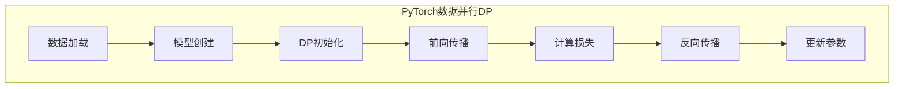

# Pytorch 数据并行

## 1.1 数据并行简介

```mermaid
graph TD
    subgraph PyTorch数据并行DP
        direction LR
        A[数据加载] --> B[模型创建]
        B --> C[DP初始化]
        C --> D[前向传播]
        D --> E[计算损失]
        E --> F[反向传播]
        F --> G[更新参数]
    end
    

```